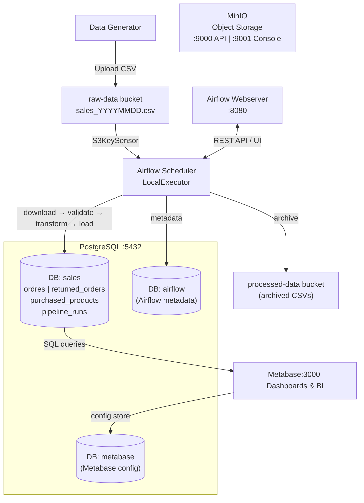
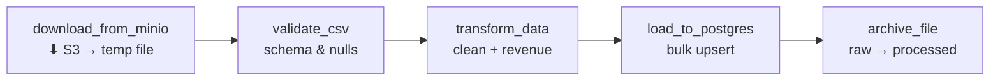
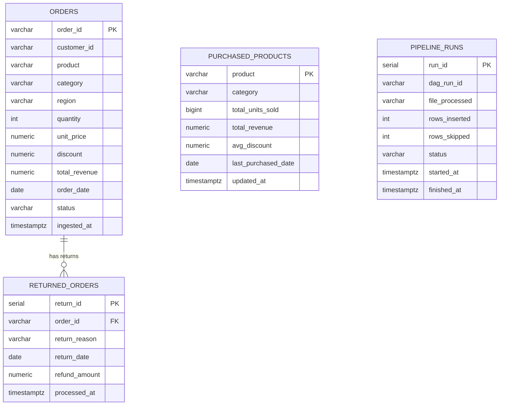

# Architecture & Data Flow

## Component Overview

---

## DAG Task Graph

---

## Infrastructure

| Layer        | Technology              | Version       | Port        |
|--------------|-------------------------|---------------|-------------|
| Database     | PostgreSQL              | 16-alpine     | 5432        |
| Object Store | MinIO                   | latest        | 9000 / 9001 |
| Orchestrator | Apache Airflow          | 2.9.1         | 8080        |
| BI / Dashboards | Metabase             | latest        | 3000        |
| Generator    | Python 3.11-slim        | —             | —           |

---

## Data Model

---

## Screenshots

Place dashboard screenshots in `docs/screenshots/` after completing Metabase setup.  
Suggested filenames:
- `01_monthly_revenue.png`
- `02_top_products.png`
- `03_revenue_by_region.png`
- `04_orders_over_time.png`
- `05_return_rate.png`
- `06_full_dashboard.png`
