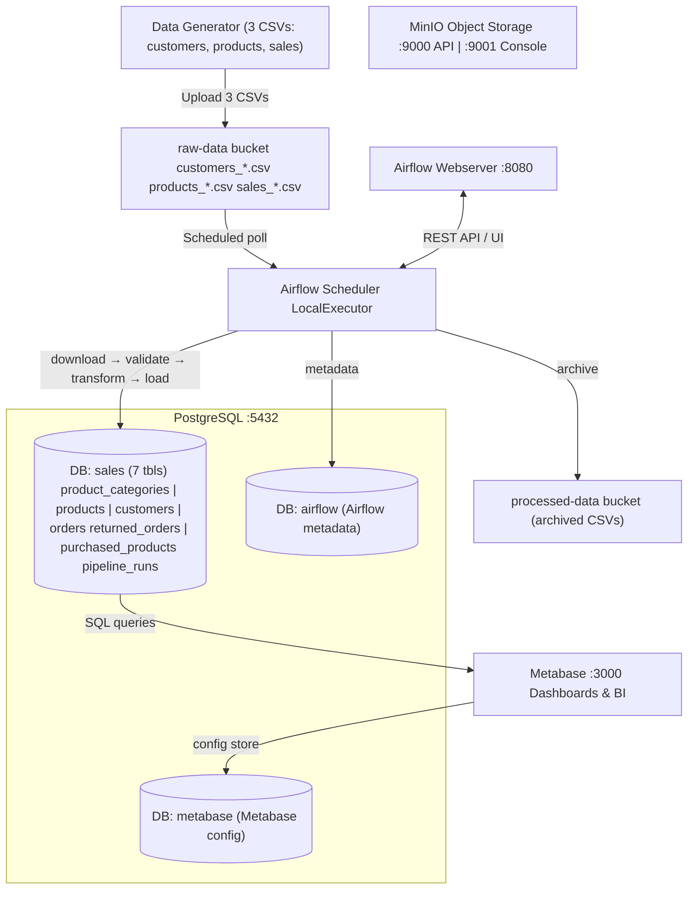
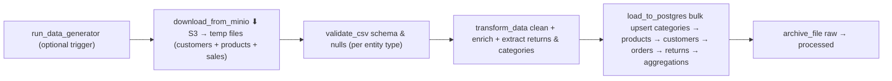
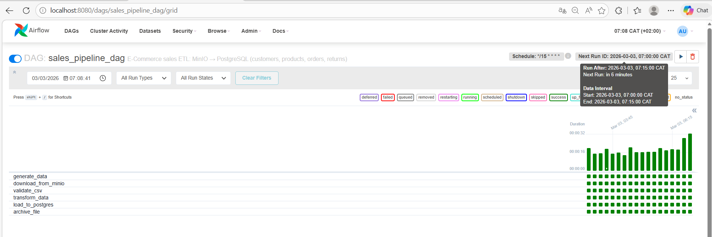
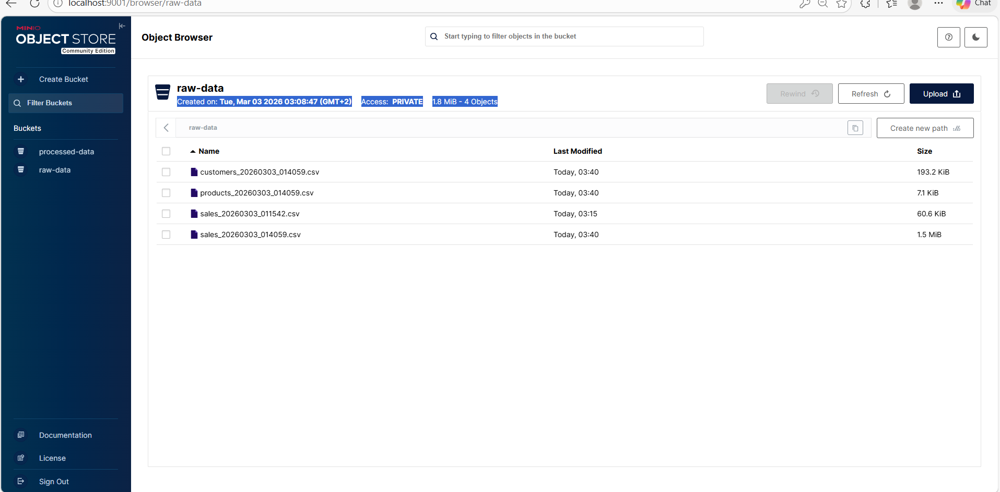
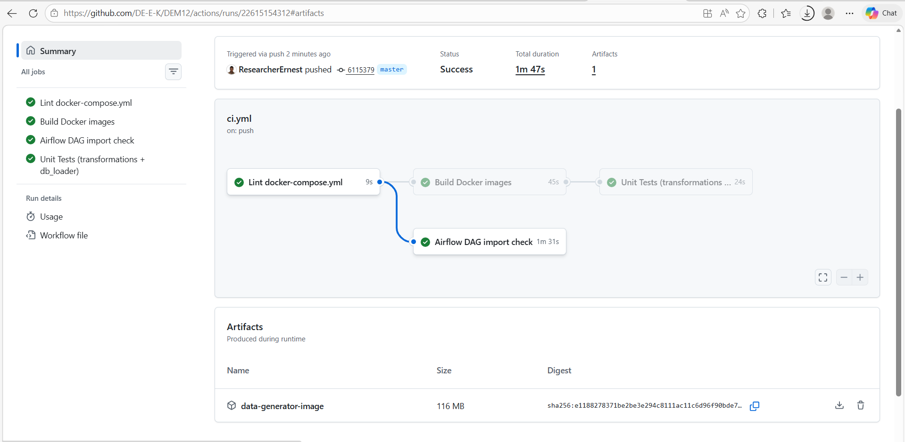

# Architecture & Data Flow

## Component Overview

```mermaid
flowchart TD
    GEN["Data Generator (3 CSVs: customers, products, sales)"]
    MINIO["MinIO Object Storage :9000 API | :9001 Console"]
    RAW["raw-data bucket customers_*.csv products_*.csv sales_*.csv"]
    AF_WEB["Airflow Webserver :8080"]
    AF_SCH["Airflow Scheduler LocalExecutor"]
    PROC["processed-data bucket (archived CSVs)"]

    subgraph PG ["PostgreSQL :5432"]
        DB_SALES[("DB: sales (7 tbls) product_categories | products | customers | orders returned_orders | purchased_products pipeline_runs")]
        DB_AF[("DB: airflow (Airflow metadata)")]
        DB_MB[("DB: metabase (Metabase config)")]
    end

    MB["Metabase :3000 Dashboards & BI"]

    GEN -->|"Upload 3 CSVs"| RAW
    RAW -->|"Scheduled poll"| AF_SCH
    AF_WEB <-->|"REST API / UI"| AF_SCH
    AF_SCH -->|"download → validate → transform → load"| DB_SALES
    AF_SCH -->|"archive"| PROC
    AF_SCH -->|"metadata"| DB_AF
    DB_SALES -->|"SQL queries"| MB
    MB -->|"config store"| DB_MB
```

---

## DAG Task Graph

```mermaid
flowchart LR
    R["run_data_generator (optional trigger)"]
    D["download_from_minio ⬇ S3 → temp files (customers + products + sales)"]
    V["validate_csv schema & nulls (per entity type)"]
    T["transform_data clean + enrich + extract returns & categories"]
    L["load_to_postgres bulk upsert categories → products → customers → orders → returns → aggregations"]
    A["archive_file raw → processed"]

    R --> D --> V --> T --> L --> A
```

---

## Infrastructure

| Layer        | Technology              | Version       | Port        |
|--------------|-------------------------|---------------|-------------|
| Database     | PostgreSQL              | 16-alpine     | 5432        |
| Object Store | MinIO                   | latest        | 9000 / 9001 |
| Orchestrator | Apache Airflow          | 2.9.1         | 8080        |
| BI / Dashboards | Metabase             | latest        | 3000        |
| Generator    | Python 3.11-slim        | —             | —           |

---

## Data Model

---

## Screenshots

### DAG Run Status

### MinIO — Raw Data Bucket

### MinIO — Processed Files Bucket

### Metabase Dashboard

### Monthly Revenue Chart

### Saved Questions Summary

> For full dashboard documentation, see [dashboard.md](dashboard.md).
