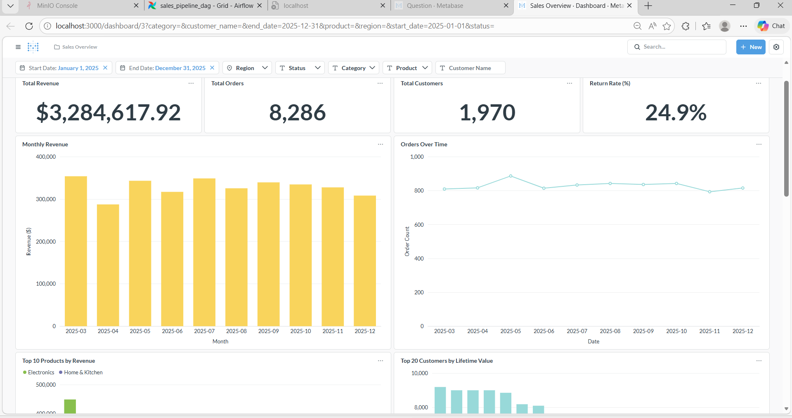
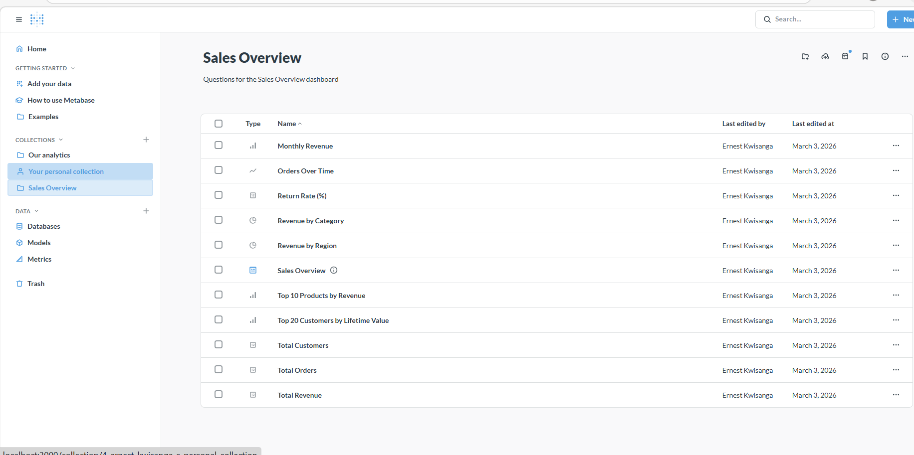
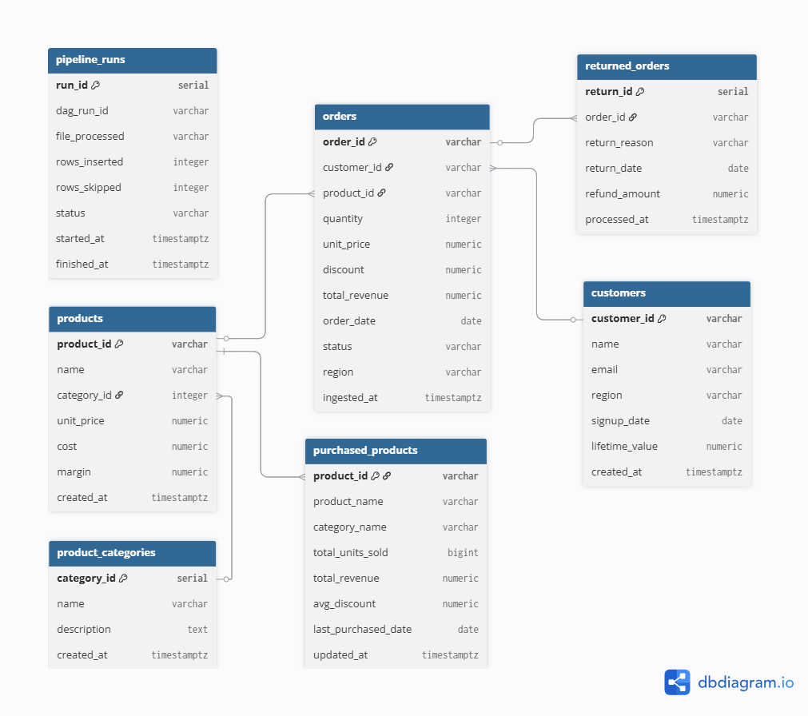

# Metabase Dashboard Documentation

> **Dashboard:** Sales Overview  
> **URL:** [http://localhost:3000/dashboard/3](http://localhost:3000/dashboard/3)  
> **Collection:** Sales Overview (ID 5)  
> **Data Source:** PostgreSQL `sales` database (Metabase DB ID 3)

---

## Table of Contents

- [Overview](#overview)
- [Access & Credentials](#access--credentials)
- [Dashboard Layout](#dashboard-layout)
- [KPI Cards](#kpi-cards)
- [Chart Cards](#chart-cards)
- [Cross-Filter Parameters](#cross-filter-parameters)
- [SQL Pattern & JOINs](#sql-pattern--joins)
- [Card–Parameter Mapping Reference](#cardparameter-mapping-reference)
- [How Filters Work](#how-filters-work)
- [Adding New Cards](#adding-new-cards)
- [Maintenance & Troubleshooting](#maintenance--troubleshooting)
- [Screenshots](#screenshots)

---

## Overview

The **Sales Overview** dashboard provides a single-pane view into the e-commerce platform's key business metrics. It consists of **10 interactive cards** (3 KPI scalars, 7 visualisations) that all respond to **7 cross-filter parameters** at the top of the page.

```
┌───────────────────────────────────────────────────────────────────┐
│  Filters:  Start Date │ End Date │ Region │ Status │ Category │   │
│            Product │ Customer Name                                │
├──────────────┬──────────────┬──────────────┬──────────────────────┤
│ Total Revenue│ Total Orders │Total Customers│   Return Rate (%)   │
├──────────────┴──────────────┴──────────────┴──────────────────────┤
│  Monthly Revenue (bar)          │  Orders Over Time (line)        │
├─────────────────────────────────┼─────────────────────────────────┤
│  Top 10 Products (bar)          │  Top 20 Customer LTV (bar)      │
├─────────────────────────────────┼─────────────────────────────────┤
│  Revenue by Region (pie)        │  Revenue by Category (pie)      │
└─────────────────────────────────┴─────────────────────────────────┘
```

---

## Access & Credentials

| Field         | Value                          |
|---------------|--------------------------------|
| URL           | http://localhost:3000           |
| Admin Email   | `kwisaern@gmail.com`           |
| Admin Password| `Admin2024!`                   |
| DB User       | `metabase_user`                |
| DB Password   | `MetabasePass2024!`            |
| Database      | `sales` (PostgreSQL)           |

---

## Dashboard Layout

The dashboard uses a **24-column grid**. Cards are arranged as follows:

| Row | Col&nbsp;Start | Col&nbsp;End | Size | Card |
|-----|-------|--------|------|------|
| 0   | 0     | 6      | 6×2  | Total Revenue (KPI) |
| 0   | 6     | 12     | 6×2  | Total Orders (KPI) |
| 0   | 12    | 18     | 6×2  | Total Customers (KPI) |
| 0   | 18    | 24     | 6×2  | Return Rate % (KPI) |
| 2   | 0     | 12     | 12×7 | Monthly Revenue (bar) |
| 2   | 12    | 24     | 12×7 | Orders Over Time (line) |
| 9   | 0     | 12     | 12×8 | Top 10 Products by Revenue (bar) |
| 9   | 12    | 24     | 12×8 | Top 20 Customer LTV (bar) |
| 17  | 0     | 12     | 12×8 | Revenue by Region (pie) |
| 17  | 12    | 24     | 12×8 | Revenue by Category (pie) |

---

## KPI Cards

### 1. Total Revenue

| Property | Value |
|----------|-------|
| Card ID  | 45 |
| Dashcard ID | 35 |
| Type     | Scalar (number) |
| SQL      | `SUM(o.total_revenue)` from `orders` |

Displays the sum of `total_revenue` across all filtered orders. Responds to all 7 filters.

### 2. Total Orders

| Property | Value |
|----------|-------|
| Card ID  | 46 |
| Dashcard ID | 36 |
| Type     | Scalar (number) |
| SQL      | `COUNT(*)` from `orders` |

Counts all orders matching the active filters.

### 3. Total Customers

| Property | Value |
|----------|-------|
| Card ID  | 47 |
| Dashcard ID | 37 |
| Type     | Scalar (number) |
| SQL      | `COUNT(DISTINCT c.customer_id)` from `customers` joined with `orders` |

Counts unique customers who have at least one order matching the active filters.

### 4. Return Rate (%)

| Property | Value |
|----------|-------|
| Card ID  | 42 |
| Dashcard ID | 38 |
| Type     | Scalar (number) |
| SQL      | `100.0 × COUNT(r.return_id) / COUNT(DISTINCT o.order_id)` |

Percentage of filtered orders that have an associated return record. Uses `LEFT JOIN returned_orders`.

---

## Chart Cards

### 5. Monthly Revenue

| Property | Value |
|----------|-------|
| Card ID  | 38 |
| Dashcard ID | 39 |
| Visualisation | Bar chart |
| X-axis   | `TO_CHAR(o.order_date, 'YYYY-MM')` |
| Y-axis   | `SUM(o.total_revenue)` |

Revenue aggregated by calendar month, sorted chronologically.

### 6. Orders Over Time

| Property | Value |
|----------|-------|
| Card ID  | 41 |
| Dashcard ID | 40 |
| Visualisation | Line chart |
| X-axis   | `TO_CHAR(o.order_date, 'YYYY-MM')` |
| Y-axis   | `COUNT(*)` |

Order volume trend by month.

### 7. Top 10 Products by Revenue

| Property | Value |
|----------|-------|
| Card ID  | 39 |
| Dashcard ID | 41 |
| Visualisation | Bar chart (horizontal) |
| X-axis   | `p.name` (product) |
| Y-axis   | `SUM(o.total_revenue)` |
| Limit    | 10 rows |

Highest-revenue products. Also includes `pc.name` (category) in the SELECT for colour grouping.

### 8. Top 20 Customer Lifetime Value

| Property | Value |
|----------|-------|
| Card ID  | 43 |
| Dashcard ID | 42 |
| Visualisation | Bar chart (horizontal) |
| X-axis   | `c.name` (customer) |
| Y-axis   | `c.lifetime_value` |
| Limit    | 20 rows |

Top customers by LTV. Joins through orders so Product/Category/Status filters apply.

### 9. Revenue by Region

| Property | Value |
|----------|-------|
| Card ID  | 40 |
| Dashcard ID | 43 |
| Visualisation | Pie chart |
| Dimension | `o.region` |
| Metric    | `SUM(o.total_revenue)` |

Regional revenue distribution pie chart.

### 10. Revenue by Category

| Property | Value |
|----------|-------|
| Card ID  | 44 |
| Dashcard ID | 44 |
| Visualisation | Pie chart |
| Dimension | `pc.name` (category) |
| Metric    | `SUM(o.total_revenue)` |

Product category revenue share.

---

## Cross-Filter Parameters

The dashboard exposes **7 parameters** as filter widgets at the top of the page:

| # | Parameter | Slug | Type | Metabase ID | Widget | Template Tag Type |
|---|-----------|------|------|-------------|--------|------------------|
| 1 | Start Date | `start_date` | `date/single` | `start_date_param` | Date picker | `date` |
| 2 | End Date | `end_date` | `date/single` | `end_date_param` | Date picker | `date` |
| 3 | Region | `region` | `string/=` | `region_param` | Dropdown (auto-populated) | `dimension` → field 1320 |
| 4 | Status | `status` | `string/=` | `status_param` | Dropdown (auto-populated) | `dimension` → field 1319 |
| 5 | Category | `category` | `string/=` | `category_param` | Dropdown (auto-populated) | `dimension` → field 1331 |
| 6 | Product | `product` | `string/=` | `product_param` | Dropdown (auto-populated) | `dimension` → field 1335 |
| 7 | Customer Name | `customer_name` | `string/=` | `customer_name_param` | Text search (ILIKE) | `text` |

**Filter behaviour:**
- All filters are **optional** — when left blank, the corresponding `WHERE` clause is skipped via Metabase's `[[optional]]` syntax.
- **Date filters** use `>=` / `<=` for range selection.
- **Region, Status, Category, Product** are **Field Filters** (dimension type) — Metabase auto-populates dropdown lists from the actual database values. They use `widget-type: string/=` for exact matching.
- **Customer Name** uses `ILIKE '%...%'` via `CONCAT('%', {{customer_name}}, '%')` for partial, case-insensitive text search.

---

## SQL Pattern & JOINs

Every card follows a consistent SQL pattern that joins across all four core tables, enabling any filter to affect any card:

```sql
SELECT <metric>
FROM orders o
  JOIN products p            ON o.product_id  = p.product_id
  JOIN product_categories pc ON p.category_id = pc.category_id
  JOIN customers c           ON o.customer_id = c.customer_id
WHERE 1=1
  [[AND o.order_date >= {{start_date}}]]
  [[AND o.order_date <= {{end_date}}]]
  [[AND {{region}}]]                                     -- Field Filter (dimension)
  [[AND {{status}}]]                                     -- Field Filter (dimension)
  [[AND {{category}}]]                                   -- Field Filter (dimension)
  [[AND {{product}}]]                                    -- Field Filter (dimension)
  [[AND c.name ILIKE CONCAT('%', {{customer_name}}, '%')]] -- Text search
<GROUP BY / ORDER BY / LIMIT as needed>
```

> **Note:** Field Filters (`type: dimension`) let Metabase generate the full `column = 'value'` clause automatically, which is why the SQL uses `[[AND {{region}}]]` instead of `[[AND o.region = {{region}}]]`. This also enables Metabase to auto-populate dropdown values from the linked database field.

### Template Tag Definitions

Each card's SQL declares these template tags in its `native.template-tags` object:

| Tag | Display Name | Type | Dimension (field ID) | SQL Clause |
|-----|-------------|------|---------------------|------------|
| `start_date` | Start Date | `date` | — | `o.order_date >= ?` |
| `end_date` | End Date | `date` | — | `o.order_date <= ?` |
| `region` | Region | `dimension` | `orders.region` (1320) | Auto-generated by Metabase |
| `status` | Status | `dimension` | `orders.status` (1319) | Auto-generated by Metabase |
| `category` | Category | `dimension` | `product_categories.name` (1331) | Auto-generated by Metabase |
| `product` | Product | `dimension` | `products.name` (1335) | Auto-generated by Metabase |
| `customer_name` | Customer Name | `text` | — | `c.name ILIKE CONCAT('%',?,'%')` |

### Exception: Return Rate (Card 42)

Uses `LEFT JOIN returned_orders r ON o.order_id = r.order_id` in addition to the standard JOINs, since it needs to calculate the ratio of returned vs total orders.

---

## Card–Parameter Mapping Reference

All 10 cards are wired to all 7 dashboard parameters. Card 48 (user-created) has no mappings.

| Dashcard ID | Card ID | Card Name | Mappings |
|-------------|---------|-----------|----------|
| 35 | 45 | Total Revenue | 7/7 |
| 36 | 46 | Total Orders | 7/7 |
| 37 | 47 | Total Customers | 7/7 |
| 38 | 42 | Return Rate (%) | 7/7 |
| 39 | 38 | Monthly Revenue | 7/7 |
| 40 | 41 | Orders Over Time | 7/7 |
| 41 | 39 | Top 10 Products | 7/7 |
| 42 | 43 | Customer LTV | 7/7 |
| 43 | 40 | Revenue by Region | 7/7 |
| 44 | 44 | Revenue by Category | 7/7 |
| 45 | 48 | Product by Status | 0/7 |

**Total wired mappings:** 70 (10 cards × 7 parameters)

Mappings use different target types based on the template tag:
- **Date & text tags** → `["variable", ["template-tag", "<tag_name>"]]`
- **Dimension tags** (Region, Status, Category, Product) → `["dimension", ["template-tag", "<tag_name>"]]`

---

## How Filters Work

### User Flow

1. Open the dashboard at http://localhost:3000/dashboard/3
2. Click any filter widget in the top bar (e.g., **Region**)
3. Type or select a value — Metabase shows matching options from the data
4. Press **Enter** or click the value to apply
5. All 10 cards re-query with the filter injected into their SQL
6. To clear, click the **×** on the filter chip

### Combining Filters

Filters are **AND**-combined. For example:
- **Region** = `North` **AND** **Category** = `Electronics` **AND** **Status** = `completed`

This shows only completed electronics orders from the North region across all cards simultaneously.

### Date Range Example

- Set **Start Date** = `2024-01-01`
- Set **End Date** = `2024-06-30`
- All cards now show data only for H1 2024

### Customer Search Example

- Type `john` in **Customer Name**
- Cards filter to orders from customers whose name contains "john" (case-insensitive)
- Works with partial matches: "John Smith", "Johnny Appleseed", etc.

---

## Adding New Cards

To add a new card that participates in cross-filtering:

### 1. Create the Saved Question

```bash
# Via Metabase API
curl -X POST http://localhost:3000/api/card \
  -H "X-Metabase-Session: <token>" \
  -H "Content-Type: application/json" \
  -d '{
    "name": "My New Card",
    "display": "bar",
    "collection_id": 5,
    "dataset_query": {
      "type": "native",
      "native": {
        "query": "SELECT ... FROM orders o JOIN products p ON ... JOIN product_categories pc ON ... JOIN customers c ON ... WHERE 1=1 [[AND o.order_date >= {{start_date}}]] [[AND o.order_date <= {{end_date}}]] [[AND o.region = {{region}}]] [[AND o.status = {{status}}]] [[AND pc.name = {{category}}]] [[AND p.name = {{product}}]] [[AND c.name ILIKE {{'"'"'%'"'"' || {{customer_name}} || '"'"'%'"'"'}}]]",
        "template-tags": {
          "start_date":    {"name":"start_date","display-name":"Start Date","type":"date"},
          "end_date":      {"name":"end_date","display-name":"End Date","type":"date"},
          "region":        {"name":"region","display-name":"Region","type":"text"},
          "status":        {"name":"status","display-name":"Status","type":"text"},
          "category":      {"name":"category","display-name":"Category","type":"text"},
          "product":       {"name":"product","display-name":"Product","type":"text"},
          "customer_name": {"name":"customer_name","display-name":"Customer Name","type":"text"}
        }
      },
      "database": 3
    },
    "visualization_settings": {}
  }'
```

### 2. Add to Dashboard

```bash
curl -X POST http://localhost:3000/api/dashboard/3/cards \
  -H "X-Metabase-Session: <token>" \
  -H "Content-Type: application/json" \
  -d '{
    "cardId": <NEW_CARD_ID>,
    "col": 0, "row": 31,
    "size_x": 12, "size_y": 8
  }'
```

### 3. Wire Parameter Mappings

Update the dashboard (`PUT /api/dashboard/3`) with `parameter_mappings` for the new dashcard, mapping each of the 7 parameter IDs to the corresponding template tag.

---

## Maintenance & Troubleshooting

### Common Issues

| Issue | Cause | Solution |
|-------|-------|----------|
| Filter shows no dropdown values | Metabase hasn't scanned the table yet | Go to **Admin → Table Metadata** → click **Re-scan** on the `sales` database |
| Card shows error after filter | SQL syntax issue in template tags | Open the card in Metabase question editor and test the SQL with hardcoded values |
| Session token expired | Metabase tokens expire after ~14 days | Re-authenticate: `POST /api/session` with email/password |
| New data not visible | Airflow DAG hasn't run | Trigger the DAG manually or wait for the 15-min schedule |
| Customer Name filter returns nothing | Name is case-sensitive in data | The `ILIKE` clause handles case-insensitivity; check that the customer name exists in the `customers` table |
| Card not responding to a filter | Missing parameter mapping | Verify the dashcard has a `parameter_mappings` entry for that parameter ID |

### Refreshing the Dashboard

- **Manual:** Click the refresh icon (↻) in the top-right of the dashboard
- **Auto-refresh:** Click the clock icon next to refresh and select an interval (1 min, 5 min, 15 min, etc.)
- **Data sync:** Metabase syncs table metadata on its own schedule. Force a sync via **Admin → Databases → Sales → Sync database schema now**

### API Quick Reference

| Action | Method | Endpoint |
|--------|--------|----------|
| Get session token | POST | `/api/session` |
| List dashboards | GET | `/api/dashboard` |
| Get dashboard detail | GET | `/api/dashboard/3` |
| Update dashboard | PUT | `/api/dashboard/3` |
| List cards in collection | GET | `/api/collection/5/items` |
| Get card detail | GET | `/api/card/<id>` |
| Update card SQL | PUT | `/api/card/<id>` |
| Execute card query | POST | `/api/card/<id>/query` |
| Sync database | POST | `/api/database/3/sync_schema` |

---

## Entity Relationship Context

The cross-filter SQL leverages these relationships:

```
product_categories ──1:N──► products ──1:N──► orders ◄──N:1── customers
                                                │
                                          returned_orders
```

All cards JOIN through `orders` as the central fact table, reaching out to dimension tables (`products`, `product_categories`, `customers`) and optionally `returned_orders` for return-related metrics.

---

## Screenshots

### Full Dashboard View



### Monthly Revenue Chart


### Saved Questions Summary



### Database Schema



---

*Last updated: 2026-03-03*
